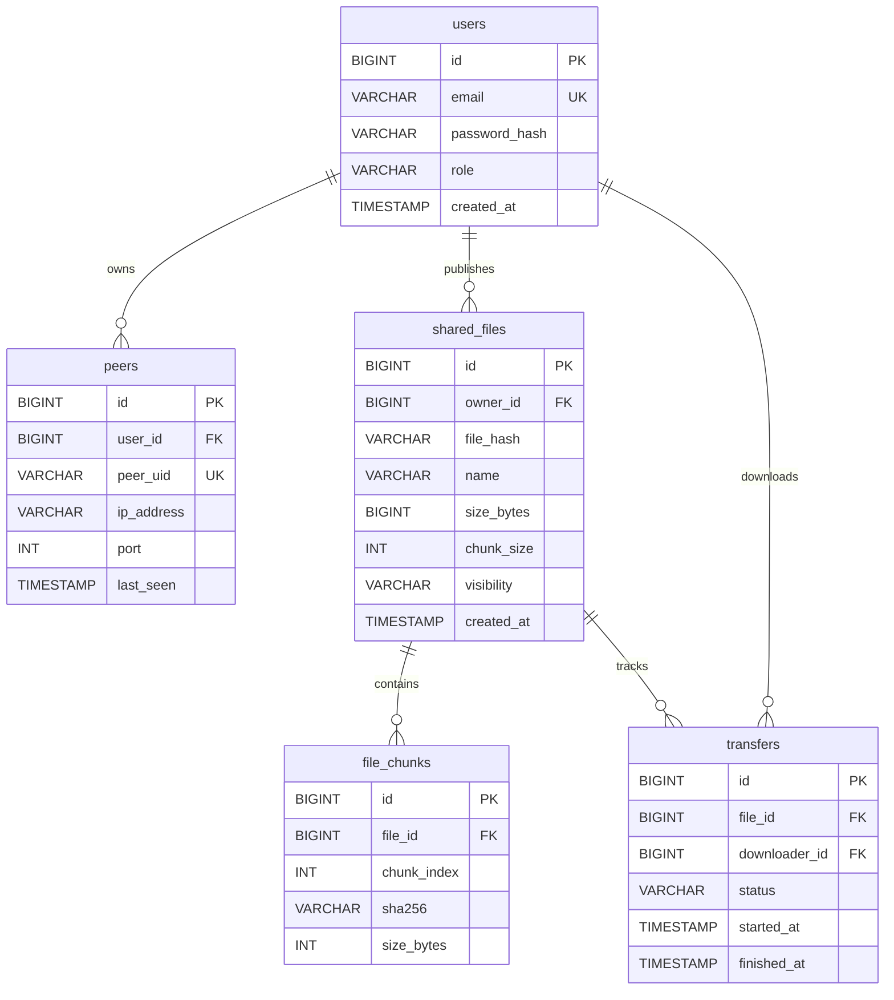

# Tracker database ER diagram

```mermaid
erDiagram
    users {
        BIGINT id PK
        VARCHAR email UK
        VARCHAR password_hash
        VARCHAR role
        TIMESTAMP created_at
    }
    peers {
        BIGINT id PK
        BIGINT user_id FK
        VARCHAR peer_uid UK
        VARCHAR ip_address
        INT port
        TIMESTAMP last_seen
    }
    shared_files {
        BIGINT id PK
        BIGINT owner_id FK
        VARCHAR file_hash
        VARCHAR name
        BIGINT size_bytes
        INT chunk_size
        VARCHAR visibility
        TIMESTAMP created_at
    }
    file_chunks {
        BIGINT id PK
        BIGINT file_id FK
        INT chunk_index
        VARCHAR sha256
        INT size_bytes
    }
    transfers {
        BIGINT id PK
        BIGINT file_id FK
        BIGINT downloader_id FK
        VARCHAR status
        TIMESTAMP started_at
        TIMESTAMP finished_at
    }
    users ||--o{ peers : owns
    users ||--o{ shared_files : publishes
    shared_files ||--o{ file_chunks : contains
    shared_files ||--o{ transfers : tracks
    users ||--o{ transfers : downloads
```
